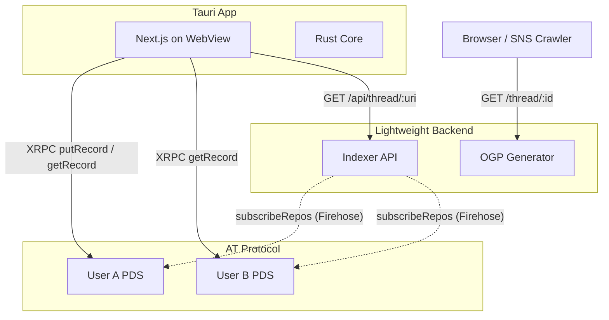
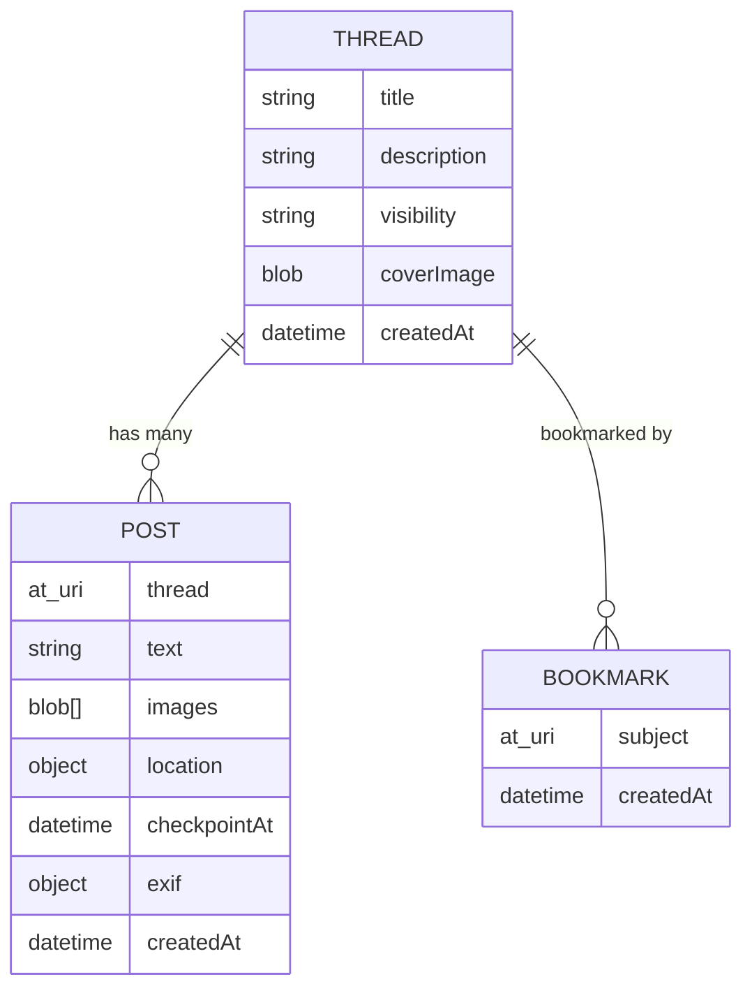

# アーキテクチャ

## 全体構成

### レイヤーの役割

| レイヤー | 技術 | 責務 |
|---|---|---|
| **アプリシェル** | Tauri (Rust) | ウィンドウ管理、ネイティブ API（ファイルアクセス、通知等）、将来のモバイル対応 |
| **フロントエンド** | Next.js (React) | UI 描画、PDS への XRPC 通信、状態管理。Tauri の WebView 内で SSG / CSR として動作 |
| **データ保存** | AT Protocol PDS | 各ユーザーの PDS にカスタム Lexicon レコードを読み書き |
| **軽量バックエンド** | Hono + Cloudflare Workers / Vercel | OGP の動的生成、Public Event の投稿集約（インデクサー） |

## AT Protocol との関わり方

### 設計方針

- **Bluesky 標準の Lexicon (`app.bsky.*`) は使わない**。投稿データはすべてカスタム Lexicon に閉じる。これにより Bluesky のタイムラインを一切汚染しない。
- **クロスポストは例外**。ユーザーが任意で実行する「シェア投稿」のみ `app.bsky.feed.post` を使い、Trailcast スレッドの URL をリンクとして含める。
- **リプライ・リアクションは持たない**。データモデルをシンプルに保ち、他ユーザーの PDS へのデータ分散による複雑さを排除する。

### 認証

Tauri アプリ内から AT Protocol の OAuth (DPOP) フローを実行し、ユーザーの PDS に対する認可トークンを取得する。
トークンは Tauri の Rust 側でセキュアに保持し、WebView からの XRPC リクエストに付与する。

## カスタム Lexicon 設計 (`net.shino3.trailcast`)

### `net.shino3.trailcast.thread`

スレッド（イベント）の親レコード。作成者の PDS に保存される。

| フィールド | 型 | 必須 | 説明 |
|---|---|---|---|
| `title` | string | Yes | スレッドのタイトル（最大 100 文字） |
| `description` | string | No | 概要テキスト（最大 500 文字） |
| `visibility` | string (enum) | Yes | `private` / `public` |
| `coverImage` | blob | No | カバー画像 |
| `createdAt` | datetime | Yes | 作成日時 |

### `net.shino3.trailcast.post`

スレッド内のチェックポイント（投稿）レコード。投稿者の PDS に保存される。

| フィールド | 型 | 必須 | 説明 |
|---|---|---|---|
| `thread` | ref (at-uri) | Yes | 紐づく `thread` レコードの AT URI |
| `text` | string | No | テキスト（最大 200 文字） |
| `images` | array of blob | No | 画像（最大 4 件） |
| `location` | object | No | `{ latitude: number, longitude: number, altitude?: number }` |
| `checkpointAt` | datetime | Yes | チェックポイント時刻（初期値は投稿時刻、あとから編集可） |
| `exif` | object | No | 写真から抽出したメタデータ（撮影位置・時刻等）。意図的に削除可能 |
| `createdAt` | datetime | Yes | 投稿日時 |

### `net.shino3.trailcast.bookmark`

他ユーザーのスレッドをお気に入り登録するレコード。閲覧者の PDS に保存される。

| フィールド | 型 | 必須 | 説明 |
|---|---|---|---|
| `subject` | ref (at-uri) | Yes | ブックマーク対象の `thread` レコードの AT URI |
| `createdAt` | datetime | Yes | ブックマーク日時 |

### レコード間のリレーション

## Tauri アプリ構成

### Next.js の役割

Tauri の WebView 内で動作するフロントエンドとして Next.js を使用する。

- **SSG (Static Site Generation)** でビルドし、Tauri にバンドルする
- ルーティングやコンポーネント設計には App Router を活用
- PDS との通信はクライアントサイド（CSR）で `@atproto/api` を使用

Tauri 内での利用のため、SSR / API Routes は使用しない。サーバーサイドの処理が必要な場合は軽量バックエンド側に委譲する。

### Rust Core の役割

- OAuth トークンのセキュアな保持・更新
- ファイルシステムアクセス（写真の EXIF 読み取り等）
- 将来的なモバイル対応時のネイティブ機能ブリッジ

## 軽量バックエンド

### 必要な理由

1. **OGP 生成**: SNS クローラーは JavaScript を実行しないため、`trailcast.shino3.net/thread/:id` へのリクエストに対してサーバーサイドで `<meta>` タグを含む HTML を返す必要がある
2. **Public Event の投稿集約**: Public スレッドでは複数ユーザーの PDS にデータが分散するため、それらを束ねるインデクサーが必要

### 技術選定（候補）

| 候補 | 長所 | 短所 |
|---|---|---|
| Hono + Cloudflare Workers + D1 | 低コスト、エッジ実行、D1 で SQL 利用可 | Firehose の常時接続に制約あり |
| Hono + Vercel (Edge Functions) | Next.js との親和性、デプロイ容易 | 長時間の Firehose 接続には不向き |
| 専用の小型サーバー（VPS 等） | Firehose の常時購読が安定 | 運用コスト・管理負荷 |

### インデクサーの動作

Public Event の投稿を集約するために、AT Protocol の Firehose (`com.atproto.sync.subscribeRepos`) を購読し、`net.shino3.trailcast.*` のレコードだけをフィルタして DB に保存する。

クライアント（Tauri アプリまたは Web）は、インデクサーの API を通じて「あるスレッドに紐づく全投稿」を時系列で取得できる。

Private Event の場合は、スレッド作成者の PDS に直接 `listRecords` するだけで済むため、インデクサーは不要。

## 未確定事項

- [ ] Next.js の SSG 出力を Tauri にバンドルする具体的なビルドパイプライン
- [ ] Tauri Mobile (iOS / Android) の対応時期と優先度
- [ ] AT Protocol OAuth (DPOP) の Tauri 内での具体的な実装方式
- [ ] インデクサーの Firehose 購読方式（常時接続 vs ポーリング vs Jetstream）
- [ ] Public Event の「参加者」管理の仕組み（招待制 / リンク共有制）
- [ ] Web 閲覧版をフル機能のクライアントにするかどうか（読み取り専用 vs 投稿も可能）
