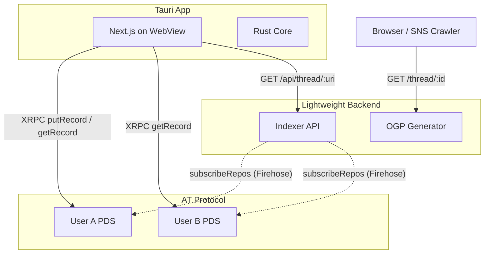
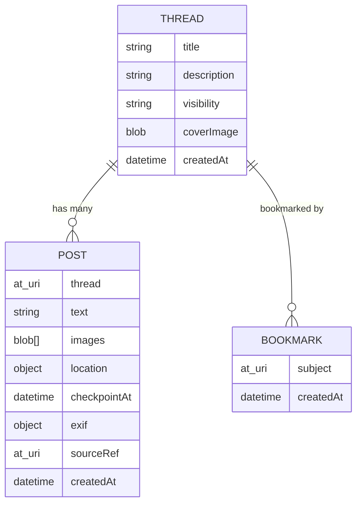

# アーキテクチャ

## 全体構成

```mermaid
flowchart TB
  subgraph client [Tauri App]
    WebView[Next.js on WebView]
    RustCore[Rust Core]
  end

  subgraph atproto [AT Protocol]
    PDS_A[User A PDS]
    PDS_B[User B PDS]
  end

  subgraph backend [Lightweight Backend]
    Indexer[Indexer API]
    OGP[OGP Generator]
  end

  WebView -- "XRPC putRecord / getRecord" --> PDS_A
  WebView -- "XRPC getRecord" --> PDS_B
  WebView -- "GET /api/thread/:uri" --> Indexer
  Browser[Browser / SNS Crawler] -- "GET /thread/:id" --> OGP

  Indexer -. "subscribeRepos (Firehose)" .-> PDS_A
  Indexer -. "subscribeRepos (Firehose)" .-> PDS_B
```

### レイヤーの役割

| レイヤー | 技術 | 責務 |
|---|---|---|
| **アプリシェル** | Tauri (Rust) | ウィンドウ管理、ネイティブ API（ファイルアクセス、通知等）、将来のモバイル対応 |
| **フロントエンド** | Next.js (React) | UI 描画、PDS への XRPC 通信、状態管理。Tauri の WebView 内で SSG / CSR として動作 |
| **データ保存** | AT Protocol PDS | 各ユーザーの PDS にカスタム Lexicon レコードを読み書き |
| **軽量バックエンド** | Hono + Cloudflare Workers / Vercel | OGP の動的生成、Public Event の投稿集約（インデクサー） |

## AT Protocol との関わり方

### 設計方針

- **Bluesky 標準の Lexicon (`app.bsky.*`) は使わない**。投稿データはすべてカスタム Lexicon に閉じる。これにより Bluesky のタイムラインを一切汚染しない。
- **クロスポストは例外**。ユーザーが任意で実行する「シェア投稿」のみ `app.bsky.feed.post` を使い、Trailcast スレッドの URL をリンクとして含める。
- **リプライ・リアクションは持たない**。データモデルをシンプルに保ち、他ユーザーの PDS へのデータ分散による複雑さを排除する。
- **位置情報 (`location`) はデバイスの現在地のみ**。投稿時に位置情報トグルが ON の場合に Geolocation API / ネイティブ GPS で取得する。写真の EXIF 位置情報とは独立して管理し、EXIF の読み取りはユーザーの任意（オプトイン）とする。
- **Bluesky 投稿からのインポートをサポート**。自分の過去の `app.bsky.feed.post` を選択してチェックポイントに変換できる。インポート元の AT URI を `sourceRef` に保持し、Web 閲覧版で元投稿へのリンクを表示可能にする。インポート時は位置情報なし。

### 認証

Tauri アプリ内から AT Protocol の OAuth (DPOP) フローを実行し、ユーザーの PDS に対する認可トークンを取得する。
トークンは Tauri の Rust 側でセキュアに保持し、WebView からの XRPC リクエストに付与する。

## カスタム Lexicon 設計 (`net.shino3.trailcast`)

### `net.shino3.trailcast.thread`

スレッド（イベント）の親レコード。作成者の PDS に保存される。

| フィールド | 型 | 必須 | 説明 |
|---|---|---|---|
| `title` | string | Yes | スレッドのタイトル（最大 100 文字） |
| `description` | string | No | 概要テキスト（最大 500 文字） |
| `visibility` | string (enum) | Yes | `private` / `public` |
| `coverImage` | blob | No | カバー画像 |
| `createdAt` | datetime | Yes | 作成日時 |

### `net.shino3.trailcast.post`

スレッド内のチェックポイント（投稿）レコード。投稿者の PDS に保存される。

| フィールド | 型 | 必須 | 説明 |
|---|---|---|---|
| `thread` | ref (at-uri) | Yes | 紐づく `thread` レコードの AT URI |
| `text` | string | No | テキスト（最大 200 文字） |
| `images` | array of blob | No | 画像（最大 4 件） |
| `location` | object | No | デバイスの現在地。位置情報トグル ON 時のみ記録。`{ latitude: number, longitude: number, altitude?: number }` |
| `checkpointAt` | datetime | Yes | チェックポイント時刻（初期値は投稿時刻、あとから編集可） |
| `exif` | object | No | 写真から抽出したメタデータ（撮影位置・時刻等）。ユーザーが任意で付与（オプトイン）。意図的に削除可能。`location` とは独立したデータ |
| `sourceRef` | ref (at-uri) | No | Bluesky 投稿からインポートした場合の元投稿 AT URI |
| `createdAt` | datetime | Yes | 投稿日時 |

### `net.shino3.trailcast.bookmark`

他ユーザーのスレッドをお気に入り登録するレコード。閲覧者の PDS に保存される。

| フィールド | 型 | 必須 | 説明 |
|---|---|---|---|
| `subject` | ref (at-uri) | Yes | ブックマーク対象の `thread` レコードの AT URI |
| `createdAt` | datetime | Yes | ブックマーク日時 |

### レコード間のリレーション

```mermaid
erDiagram
  THREAD ||--o{ POST : "has many"
  THREAD ||--o{ BOOKMARK : "bookmarked by"

  THREAD {
    string title
    string description
    string visibility
    blob coverImage
    datetime createdAt
  }

  POST {
    at_uri thread
    string text
    blob[] images
    object location
    datetime checkpointAt
    object exif
    at_uri sourceRef
    datetime createdAt
  }

  BOOKMARK {
    at_uri subject
    datetime createdAt
  }
```

## Tauri アプリ構成

### Next.js の役割

Tauri の WebView 内で動作するフロントエンドとして Next.js を使用する。

- **SSG (Static Site Generation)** でビルドし、Tauri にバンドルする
- ルーティングやコンポーネント設計には App Router を活用
- PDS との通信はクライアントサイド（CSR）で `@atproto/api` を使用

Tauri 内での利用のため、SSR / API Routes は使用しない。サーバーサイドの処理が必要な場合は軽量バックエンド側に委譲する。

### Rust Core の役割

- OAuth トークンのセキュアな保持・更新
- ファイルシステムアクセス（写真の EXIF 読み取り等）
- 将来的なモバイル対応時のネイティブ機能ブリッジ

## 軽量バックエンド

### 必要な理由

1. **OGP 生成**: SNS クローラーは JavaScript を実行しないため、`trailcast.shino3.net/thread/:id` へのリクエストに対してサーバーサイドで `<meta>` タグを含む HTML を返す必要がある
2. **Public Event の投稿集約**: Public スレッドでは複数ユーザーの PDS にデータが分散するため、それらを束ねるインデクサーが必要

### 技術選定（候補）

| 候補 | 長所 | 短所 |
|---|---|---|
| Hono + Cloudflare Workers + D1 | 低コスト、エッジ実行、D1 で SQL 利用可 | Firehose の常時接続に制約あり |
| Hono + Vercel (Edge Functions) | Next.js との親和性、デプロイ容易 | 長時間の Firehose 接続には不向き |
| 専用の小型サーバー（VPS 等） | Firehose の常時購読が安定 | 運用コスト・管理負荷 |

### インデクサーの動作（採用: Cloudflare D1 + A+C 方式）

Firehose の常時購読は採らない。Workers は長時間接続に向かず、専用サーバの運用コストに見合わないため。代わりに次の 2 経路でインデックスを維持する。

| | 方式 | 役割 |
|---|---|---|
| **A** | クライアント write-through | 投稿・編集・削除の直後にクライアントが `/api/index/post` を叩き、即座に反映する |
| **C** | オンデマンド同期 | 設定画面の「同期」から自分の repo を全走査し、インデックスを作り直す。A の取りこぼしと失敗の回復手段 |

将来 Public スレッドが本格運用され A+C で追いつかなくなったら、Firehose / Jetstream 購読を再検討する。

#### 原則

- **正本は常に PDS。D1 は at-uri の紐付けだけを持つ導出キャッシュ**で、全消ししても各ユーザーの同期で完全に再構築できる。本文・画像・位置情報は D1 に置かない。
- **インデックス対象は Public スレッドのみ。** Private Event はスレッド作成者の PDS に直接 `listRecords` するだけで済むため、インデクサーを通さない。
- **書き込みは必ずサーバ側で検証する。** クライアントは post の at-uri を渡すだけで、Worker が投稿者の PDS に `getRecord` して実在と `thread` フィールド、スレッドの `visibility` を確認してから行を作る。これによりクライアント認証なしで、嘘の紐付けを書き込めない構造になる。
- **読み取りは D1 を優先し、失敗したら PDS 直読みにフォールバック**する。D1 が落ちてもアプリは従来の挙動で動き続ける。
- **インデックスからの削除は PDS からの削除に従属させる。** 「インデックスだけ消す」API は用意しない（本人確認の仕組みが必要になるため）。ユーザーは PDS 上のレコードを消してから同期すれば、世代 GC でインデックスからも落ちる。

#### スキーマ・API

`db/schema.sql`（`post_index` / `sync_state`）と `functions/api/index/*` を参照。

| endpoint | 用途 |
|---|---|
| `GET /api/index/thread?uri=` | スレッドに紐づく post の at-uri を `checkpoint_at` 昇順で返す |
| `POST /api/index/post` | 1 件を検証して upsert。PDS 上に無ければ行を削除（削除の伝播） |
| `POST /api/index/sync` | 指定 repo を 1 ページずつ走査して upsert。cursor を返すのでクライアントが回す |
| `GET /api/index/status?did=` | 最終同期日時・インデックス件数 |

同期の世代管理は、1 ページ目でサーバが発行する `startedAt` をクライアントが echo し、全ページを走り切った時点で `indexed_at < startedAt` の行を消すことで行う。途中で中断した場合は消さないので、インデックスが欠けることはない。

## 未確定事項

- [ ] Next.js の SSG 出力を Tauri にバンドルする具体的なビルドパイプライン
- [ ] Tauri Mobile (iOS / Android) の対応時期と優先度
- [ ] AT Protocol OAuth (DPOP) の Tauri 内での具体的な実装方式
- [ ] Public Event の「参加者」管理の仕組み（招待制 / リンク共有制）
- [ ] Web 閲覧版をフル機能のクライアントにするかどうか（読み取り専用 vs 投稿も可能）
